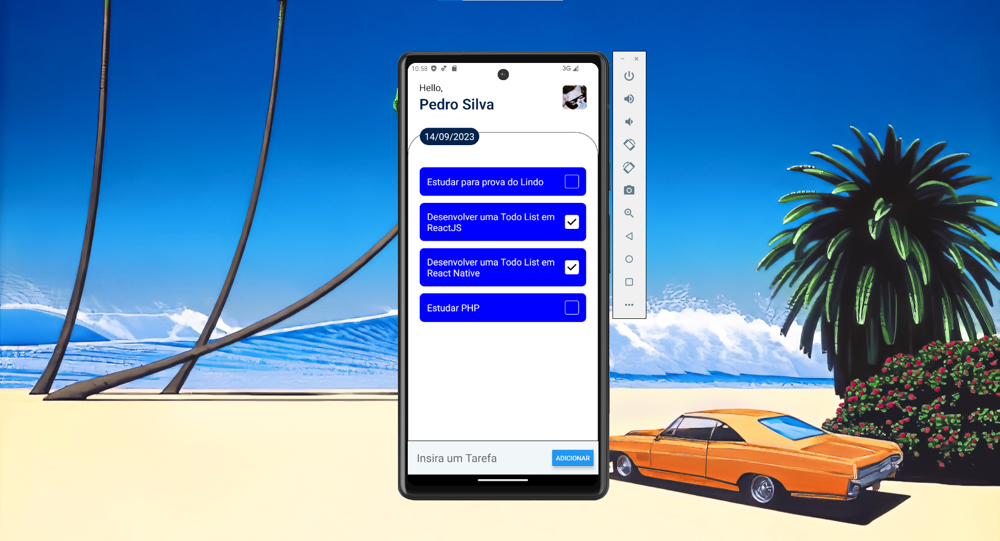

# Todo List em React Native

#### Meu primeiro aplicativo feito em React Native.

###

Com esse aplicativo consegui entender melhor alguns conceitos do React em si, como o useState, e alguns conceitos do Javascript como o `Map()` e `Filter()`.
Além disso conheci novos componentes do React Native como o _ScrollView_, _Alert_ e _TouchableOpacity_

###

Ferramentas utilizadas:

- VScode (IDE)
- Android Studio (Emulador)
- React Native
- Expo
